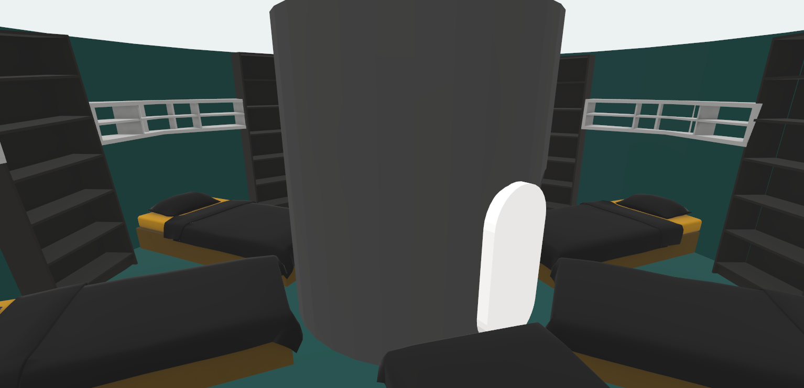
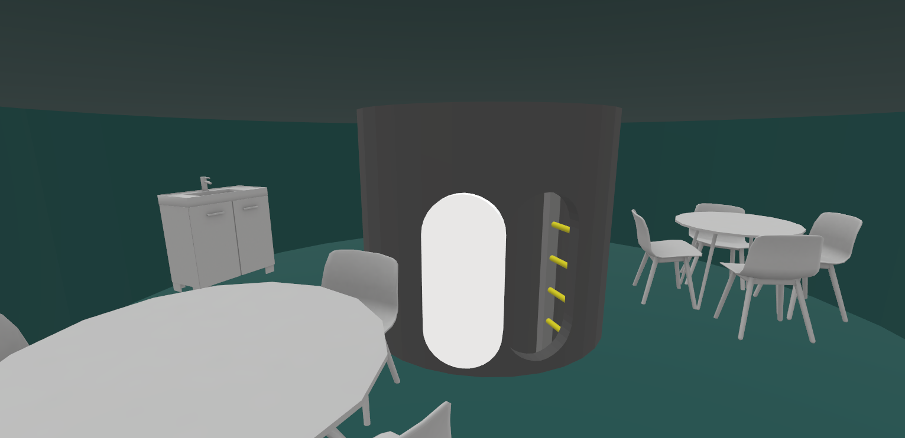
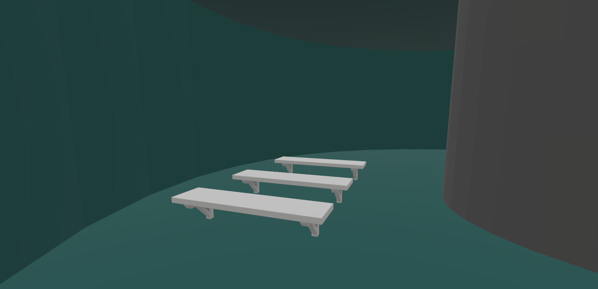
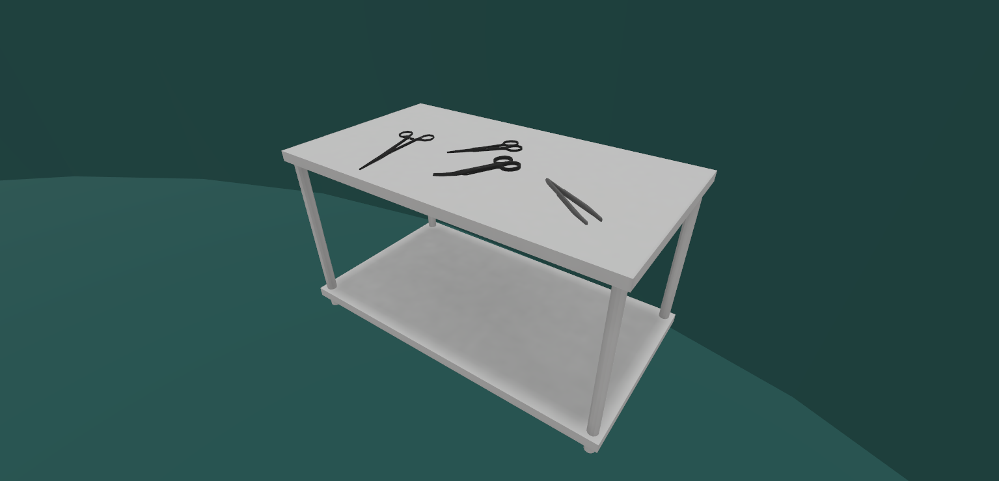
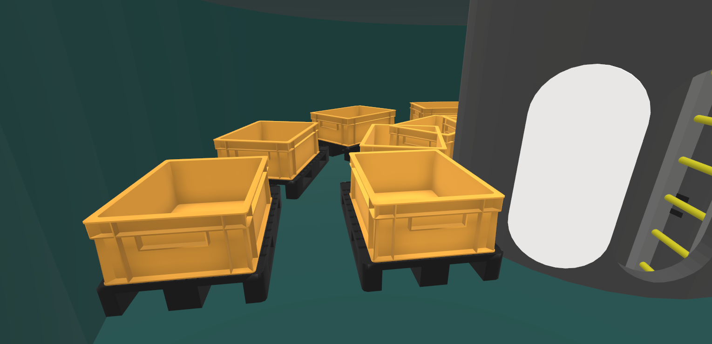

# Hello Spaceship!
My mission report for SpaceX rocket interior design.

## Crew Quarters
The top two floors of the spaceship are reserved for the crews' sleeping quarters.
By having six beds per floor, the spaceship can accommodate 12 crew members.
Stated by the Mars mission requirements, this should be enough.
At the entrance of both rooms, the crew members are supplied with a computer desk
which they can use to communicate with mission control or family members.

## Common Area
This dual-level mess and recreation area integrates a closed-loop water reclamation and thermal management system. During the mission, crew-members can relax and recharge here. This multipurpose environment can be used to cook, do laundry, eat, drink, and socialise with colleagues. Maybe even play some board- or videogames.

## Exercise Equipment
In the middle of the spaceship, the crew members will find an exercise area. Using weights, the crew can keep up their physical wellbeing on these exercise benches. Hidden in the walls are stowed threadmills used for keeping the crew's legs from deteriorating during long space missions.

## Medical Equipment
Should the unfortunate situation arise where exercise will not be enough to keep one healthy and a crew member gets wounded, the medical professional on the ship is provided with all the medical equipment they would need. This medical station has compartments that contain all the tools.

## Life Support
Our new model SpaceX spaceship has a state-of-the-art life support system. Using an array of houseplants, enough CO2 will be converted to supply our brave space explorers with enough oxygen to survive. The system will need constant care, so our crew will include an experienced gardener.

## Storage Facility
Going around the central ladder-tube, a thin hallway with storage boxes on pallets stores all the crew member's belongings, as well as enough food for the mission and all other supplies needed for it. If by chance, the water system on board fails, enough water for about a week is also stored here.

## Power Supply
Under this room, the spaceship's power supply is stored. This newest model is a hybrid. Using h2 gas as well as the newest electro-magnet and solar panels, this spaceship can always return to earth. All of this power is managed by the ship's fusebox on the lowest inhabitable floor. As to not lure crew members to mess with this vital part of the ship, it is the only object in this room.
